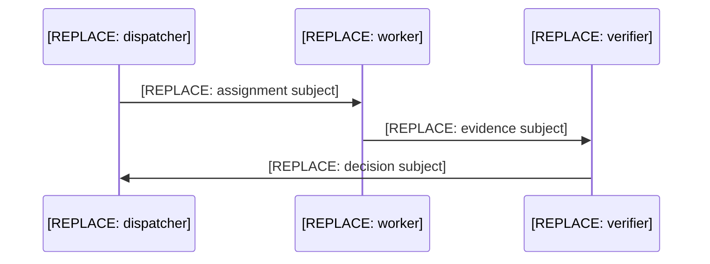
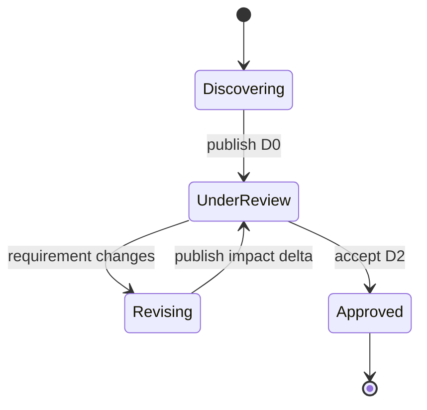
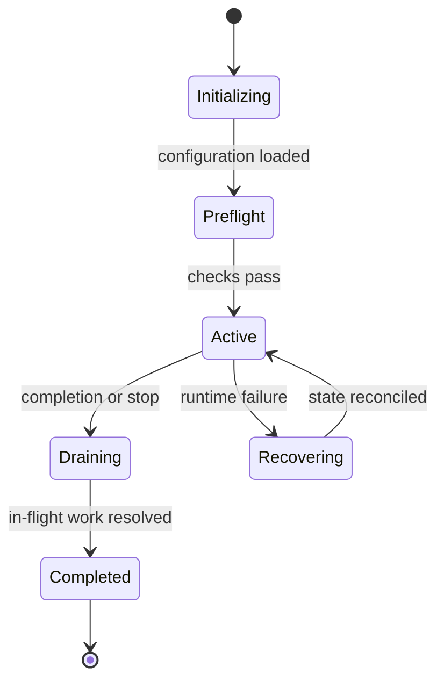
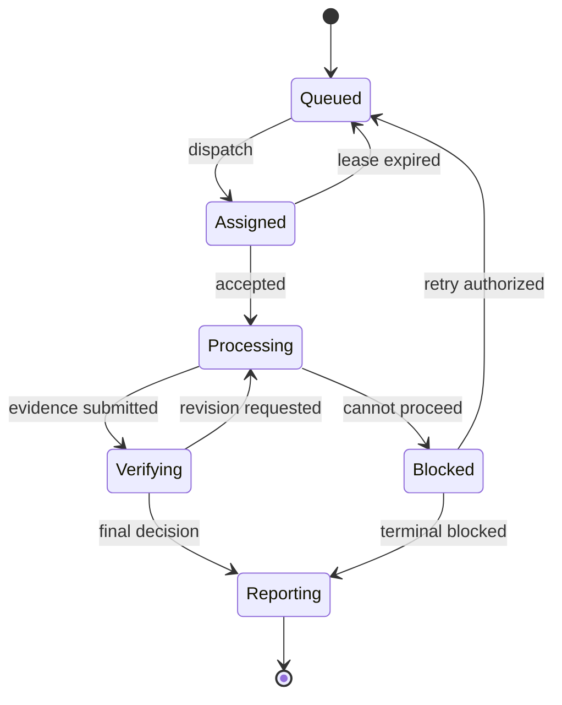

# Team Harness Dossier

Maturity: [REPLACE: D0, D1, or D2]

Design status: [REPLACE: under review, approved, or another explicit state]

## Objectives, Scope, and Acceptance Criteria

Objective: [REPLACE: team objective]

Scope:

- [REPLACE: in-scope outcome]

Non-goals:

- [REPLACE: explicit non-goal]

Acceptance criteria:

- [REPLACE: observable success condition]

## Assumptions, Decisions, and Open Questions

Assumptions:

- [REPLACE: assumption and consequence]

Accepted decisions:

- [REPLACE: decision and owner]

Open questions:

- [REPLACE: one material unresolved question]

## Domain Vocabulary

```yaml
domain_vocabulary:
  work_stream: [REPLACE: domain term]
  work_item: [REPLACE: domain term]
  attempt: [REPLACE: domain term]
  evidence: [REPLACE: domain term]
  decision: [REPLACE: domain term]
  dispatch_queue: [REPLACE: domain term]
  completion_policy: [REPLACE: domain term]
```

## Roles, Capabilities, and Ownership

| Role | Purpose | Inputs | Outputs | Authority | Prohibited authority | Capacity | Failure and recovery |
|---|---|---|---|---|---|---|---|
| [REPLACE: role] | [REPLACE: purpose] | [REPLACE: inputs] | [REPLACE: outputs] | [REPLACE: owned mutations] | [REPLACE: reserved actions] | [REPLACE: capacity] | [REPLACE: behavior] |

Authoritative ownership:

| Object | Single writer | Readers | Persistence | Conflict rule |
|---|---|---|---|---|
| [REPLACE: state, queue, artifact, or decision] | [REPLACE: owner] | [REPLACE: readers] | [REPLACE: record] | [REPLACE: version or transaction rule] |

## Team Topology

```mermaid
flowchart LR
    Intake[[REPLACE: intake role]] -->|[REPLACE: work event]| Worker[[REPLACE: worker role]]
    Worker -->|[REPLACE: evidence event]| Verifier[[REPLACE: verifier role]]
    Verifier -->|[REPLACE: decision event]| Coordinator[[REPLACE: coordinator role]]
```

## Primary Work Flow



## Design Session State Machine



## Team Lifecycle State Machine



## Work Item Lifecycle State Machine



## Transition Contract

| Current state | Event | Guard | Next state | Owner | Persistence | Side effect | Failure path | Recovery |
|---|---|---|---|---|---|---|---|---|
| [REPLACE: source] | [REPLACE: semantic event] | [REPLACE: observable guard] | [REPLACE: destination] | [REPLACE: single owner] | [REPLACE: durable record] | [REPLACE: effect or none] | [REPLACE: failure state and evidence] | [REPLACE: idempotent resume rule] |

## Scheduling, Queueing, and Concurrency

Topology pattern: [REPLACE: pipeline, worker pool, fan-out/fan-in, hierarchical, or peer]

Scheduling policy: [REPLACE: batch barrier, asynchronous refill, priority, work stealing, or another explicit policy]

- Queue owner and persistence: [REPLACE: contract]
- Eligibility and priority: [REPLACE: contract]
- Assignment lease and acceptance: [REPLACE: contract]
- Global and per-role capacity: [REPLACE: limits]
- Backpressure and recovery: [REPLACE: contract]
- Retry and reassignment: [REPLACE: contract]
- Completion race and in-flight draining: [REPLACE: contract]

## Message Contract

| Subject | Sender | Recipient policy | Triggered transition | Required payload | Delivery | Deduplication | Timeout | Failure result |
|---|---|---|---|---|---|---|---|---|
| [REPLACE: subject] | [REPLACE: sender] | [REPLACE: recipient rule] | [REPLACE: transition] | [REPLACE: IDs, version, evidence] | [REPLACE: delivery semantics] | [REPLACE: key and record] | [REPLACE: deadline owner] | [REPLACE: event or state] |

## Persistence, Identity, and Recovery

Persistent artifacts:

| Record | Path, table, or service | Writer | Retention | Recovery use |
|---|---|---|---|---|
| [REPLACE: record] | [REPLACE: location] | [REPLACE: single writer] | [REPLACE: retention] | [REPLACE: reconciliation behavior] |

Identity rules:

- Work stream: [REPLACE: stable identity]
- Work item: [REPLACE: stable identity]
- Attempt: [REPLACE: per-execution identity]
- Event, causation, and correlation: [REPLACE: identity contract]
- Actor and runtime handle mapping: [REPLACE: mapping]

Recovery model: [REPLACE: restart, replay, deduplication, and stale-owner behavior]

## Runtime Safety and Operations

- Model and reasoning posture: [REPLACE: decision]
- Credentials and gateway: [REPLACE: least-privilege decision]
- Workspace isolation: [REPLACE: decision]
- Resource limits: [REPLACE: limits]
- Preflight: [REPLACE: blocking checks]
- Runtime audit: [REPLACE: signals, thresholds, and owners]
- Graceful and forced stop: [REPLACE: contracts]
- Cleanup and rerun: [REPLACE: exact targets and lineage rules]

## Validation Plan

| Scenario | Input or fault | Expected states | Expected evidence | Forbidden side effect | Pass criteria |
|---|---|---|---|---|---|
| [REPLACE: scenario] | [REPLACE: input] | [REPLACE: state path] | [REPLACE: durable evidence] | [REPLACE: must not occur] | [REPLACE: observable result] |

Include happy path, rejection, blocking, timeout, delivery failure, replay, completion race, draining, forced stop, and authorization-boundary tests.

## Authorization Boundary

Current authorization: [REPLACE: design only, artifact generation, or named live operation]

Next boundary requiring approval: [REPLACE: exact proposed action and scope]

Actions not authorized: [REPLACE: explicitly excluded mutations]

## Revision Deltas

| Revision | Changed | Affected | Unchanged | Assumptions changed | Approval state |
|---|---|---|---|---|---|
| [REPLACE: revision] | [REPLACE: change] | [REPLACE: surfaces] | [REPLACE: stable surfaces] | [REPLACE: added, resolved, invalidated] | [REPLACE: state] |
