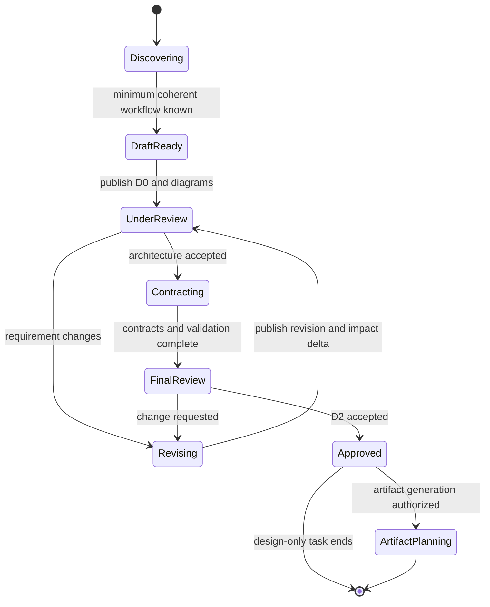

# Interaction and Maturity

## Design-session state

Maintain one current design and move it through explicit states:



Return to discovery when the objective, authority model, or basic topology changes. Preserve accepted decisions that do not conflict with the change.

## Minimum coherent workflow

Publish D0 once these facts are known or safely assumed:

1. team objective;
2. initial roles or capabilities;
3. primary flow of work between them;
4. completion or terminal condition.

Put uncertainty under `Assumptions` and `Open questions`. Ask one question only when its answer could materially change the next design revision.

## Maturity contract

### D0 Concept

Include:

- objective, scope, non-goals, assumptions, and open questions;
- initial role/capability table;
- domain vocabulary map;
- topology and primary workflow Mermaid diagrams;
- preliminary design-session, team, and work-item states;
- completion hypothesis and major risks.

D0 is intentionally reviewable before all contracts are settled. Mark assumed owners and transitions visibly.

### D1 Contract

Add:

- authoritative role, state, queue, and artifact ownership;
- selected routing and scheduling policy;
- event or mailbox subject catalog and payload fields;
- transition table with guards, failures, and recovery;
- identity, idempotency, retry, timeout, stale, and blocked semantics;
- concurrency, backpressure, in-flight, draining, and completion rules;
- evidence requirements and decision authority.

Do not leave a rejected, blocked, stale, timed-out, or undeliverable item without a downstream path.

### D2 Implementable

Add:

- role prompt contracts and prohibited authority;
- model, reasoning, credentials, workspace, gateway, and notifier posture;
- persistent artifact layout and authoritative records;
- preflight, runtime audit, launch, stop, cleanup, and rerun contracts;
- acceptance tests, negative tests, and required failure evidence.

Do not label a design D2 when any mandatory state machine, transition owner, persistence record, or stop condition remains unresolved.

## Response shape during revision

After D0 exists, respond in this order:

1. direct answer to the user's immediate request;
2. revised sections only, with enough surrounding context to review them;
3. impact delta;
4. updated diagrams and tables;
5. assumption changes;
6. at most one next material question.

Use a compact impact delta:

```text
Changed: scheduling policy -> asynchronous refill
Affected: dispatcher, queue ownership, result event, completion race, liveness audit
Unchanged: evidence producer, acceptance authority, merge ownership
```

Name conflicts explicitly. For example: `This change conflicts with the accepted single-writer queue rule; the revision transfers queue ownership from the coordinator to the dispatcher.`

## Approval language

Record approvals narrowly:

- `D0 accepted` accepts the concept, not its contracts.
- `D1 accepted` accepts architecture and protocol contracts, not runtime details.
- `D2 accepted` accepts an implementable design, not file generation or launch.
- `Generate artifacts` authorizes project-file changes within the stated destination.
- `Launch` authorizes the named live operation only.

If approval is ambiguous, remain at the current boundary and ask one concise question.
