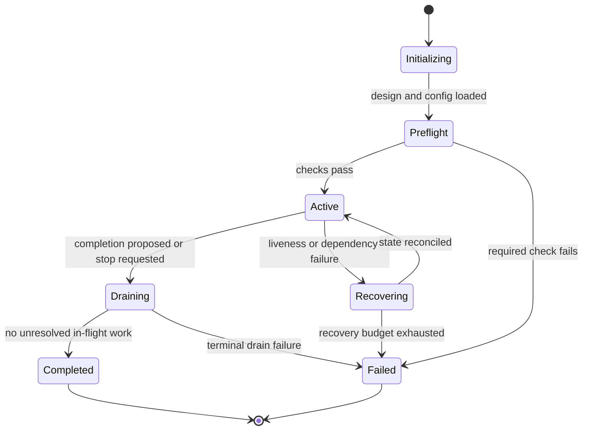
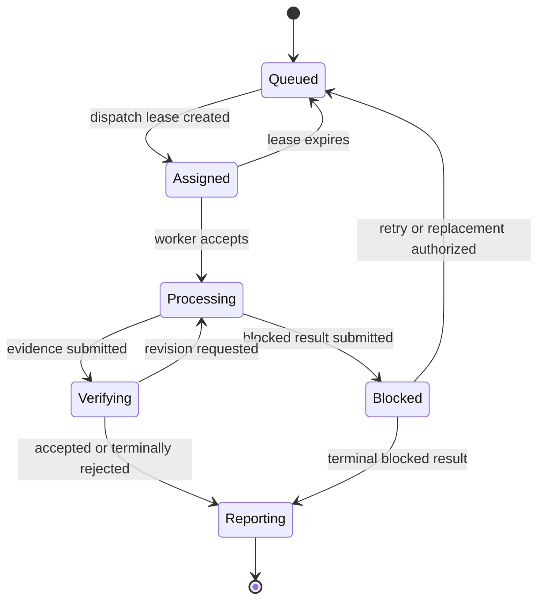

# State and Message Contracts

## Mandatory state-machine layers

### Design session

Cover discovery, first draft, review, revision, contract completion, approval, and the artifact-generation boundary. A requirement change may move the session backward without discarding unaffected accepted decisions.

### Team lifecycle

Adapt this baseline:



Name the owner and durable record for each team state. Terminal states must reject new dispatch.

### Work item or worker lifecycle

Adapt this baseline to the selected scheduler:



Do not copy the baseline unchanged when the domain needs cancellation, partial success, aggregation, quorum, or human approval.

## Transition table

Record every transition with these fields:

| Field | Rule |
|---|---|
| Current state | One authoritative source state. |
| Event | One semantic trigger; include mailbox subject when applicable. |
| Guard | Observable preconditions. |
| Next state | One explicit destination. |
| Owner | Exactly one role permitted to commit. |
| Persistence | Durable state, table, file, or service record. |
| Side effect | Message, task, artifact, or `none`. |
| Failure path | State and evidence emitted on failure. |
| Recovery | Idempotent restart or replay behavior. |

Check that every non-terminal state has an outgoing transition and every failure state has a downstream exit or is explicitly terminal.

## Message catalog

Define a semantic subject for each protocol event. Avoid overloading one subject with unrelated transitions.

| Field | Requirement |
|---|---|
| Subject | Stable semantic name such as `work.assigned`. |
| Sender | One role or explicit set of allowed roles. |
| Recipient policy | Named role, instance, group, or routing rule. |
| Triggered transition | State change or no-state-change notification. |
| Required payload | IDs, versions, evidence references, and decision fields. |
| Delivery | At-most-once, at-least-once, or effectively-once. |
| Deduplication | Key and durable record used to suppress replay. |
| Timeout | Observable deadline and owner of the timer. |
| Failure result | Event or state produced when delivery fails. |

Recommended common fields:

```yaml
event_id: unique-event-id
subject: work.assigned
work_stream_id: stable-stream-id
work_item_id: stable-item-id
attempt_id: execution-id
correlation_id: decision-chain-id
causation_id: triggering-event-id
actor_id: dispatcher-instance-id
state_version: 12
occurred_at: durable-timestamp
payload: {}
```

## Delivery and idempotency

Assume messages can be duplicated, delayed, reordered, or lost unless the runtime proves otherwise.

- Persist deduplication keys before acknowledging side effects.
- Make state commits conditional on expected state and version.
- Treat a replayed final decision as a no-op when its content matches.
- Reject a conflicting second final decision and emit evidence.
- Keep artifact creation deterministic or name it by attempt ID.
- Reconcile mailbox state against authoritative persistence after restart.

## Required failure paths

Model explicit exits for:

- assignment rejection;
- worker blocked;
- processing timeout;
- stale heartbeat or progress;
- evidence validation failure;
- delivery failure;
- owner restart;
- duplicate or late result;
- retry budget exhausted;
- completion racing with dispatch.

Avoid `notify coordinator` as a complete recovery rule. State what the coordinator persists, decides, and emits next.

## Consistency review

For each transition, verify that:

1. its event exists in the message catalog or is named as a local/runtime trigger;
2. its owner has matching authority in the role contract;
3. its persistence record exists in the artifact layout;
4. its source and destination appear in the correct Mermaid diagram;
5. its failure and recovery events lead to defined transitions;
6. its IDs and versions are sufficient for idempotent replay.
